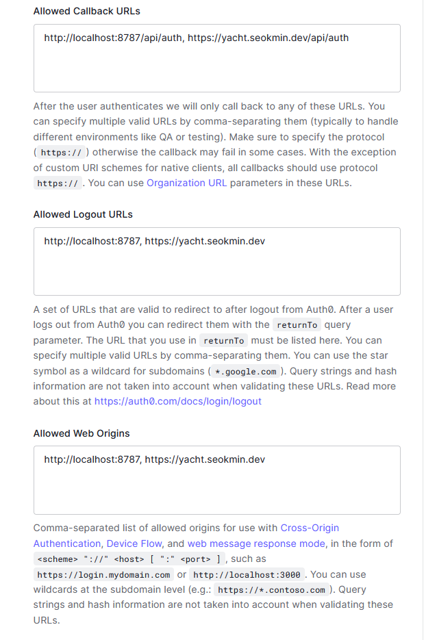

# edge-yacht

Multiplayer [Yacht](<https://en.wikipedia.org/wiki/Yacht_(dice_game)>) game on [Cloudflare Workers](https://workers.cloudflare.com/).


## Features

- Monorepo
- TypeScript
- CI/CD with GitHub Actions
- Authentication
- WebSockets and [Durable Objects](https://developers.cloudflare.com/workers/runtime-apis/durable-objects)
- Store user data in [Cloudflare Workers KV](https://www.cloudflare.com/products/workers-kv)
- Static site with [Gatsby](https://www.gatsbyjs.org/)
- Deployed on [Cloudflare Pages](https://pages.cloudflare.com/) and Cloudflare Workers
- 3D objects with [react-three-fiber](https://github.com/pmndrs/react-three-fiber)
- Pre-baked physics simulation powered by [Unreal Engine 4](https://www.unrealengine.com/)

## Local development

1. Clone the repository:
   ```sh
   $ git clone https://github.com/SeokminHong/edge-yacht.git
   ```
2. (Optional) Setup a regular [Auth0](https://auth0.com/) application.
   
3. Copy environment template file and setup variables:
   ```sh
   $ cp packages/api/.env.template packages/api/.env.dev
   ```
4. Install dependencies
   ```sh
   $ yarn install
   ```
5. Start development server and open browser and go to `http://localhost:8787`
   ```sh
   $ yarn develop
   ```

## Project Structure

This project uses [Yarn workspaces](https://yarnpkg.com/features/workspaces) to organize APIs, frontends, and shared interfaces.

### `packages/api`

A worker API that runs on Cloudflare Workers. It handles authentication, authorization, making sessions for game, and storing user data. It can run on a local development server powered by [miniflare](https://miniflare.dev/).

### `packages/shared`

A common type and logics for API and frontend. It contains shared types and interfaces.

### `packages/www`

A frontend that runs on Cloudflare Pages. It is build with [Gatsby](https://www.gatsbyjs.com/).

## License

[MIT](./LICENSE)
